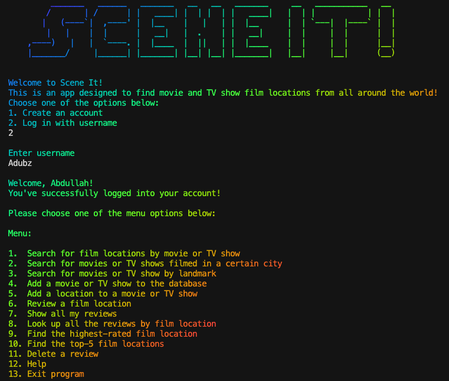

# Scene It !

Scene It! is a CLI application designed to find movie and TV show film locations from all around the world! Movie fans can search for film locations by city or landmark, and they can write reviews of film locations that they have visited themselves. This database also allows users to look up highest-rated reviews and add more locations and movies to the database. 

## Screenshot

 ## Available features:
 
  - Core Functionalities:
    - **User can search for all locations from a certain movie.**
    - **User can search for all movies filmed in a certain location.**
    - **Add a movie location to places they’ve been to.**
    - **Delete a review and a rating of a movie location.**
    - **User can create an account.**
    - **User can add Movie and/or MovieLocation.**
  - Enhanced Functionalities:
    - **Add or update a review and a rating to a movie location.**
    - **User can lookup all reviews for certain movie location.**
    - **User can lookup highest rated movie location.**
    - **User can lookup a list of top 5 movie locations.**

## Installation

- Fork and clone this repo
- To run this application, cd into the file directory
  - bundle install
  - run "rake db:migrate"
  - run "rake db:seed" 
  - run "ruby bin/run.rb" in the file directory.
  
**Enter "bash | lolcat" in the terminal to create the rainbow-colored text effect. Enjoy!**

## Authors
- 👤 Abdullah Albasha (https://github.com/Adubz97)

- 👤 Christina Sohn (https://github.com/chsohn15)

## Contributing
Bug reports and pull requests are welcome on GitHub at https://github.com/Adubz97/cli-app-Scene-it/issues. This project is intended to be a safe, welcoming space for collaboration, and contributors are expected to adhere to the [Contributor Covenant](http://contributor-covenant.org) code of conduct.

## 📝 License 
The code is available as open source under the terms of the [MIT License](https://opensource.org/licenses/MIT).
